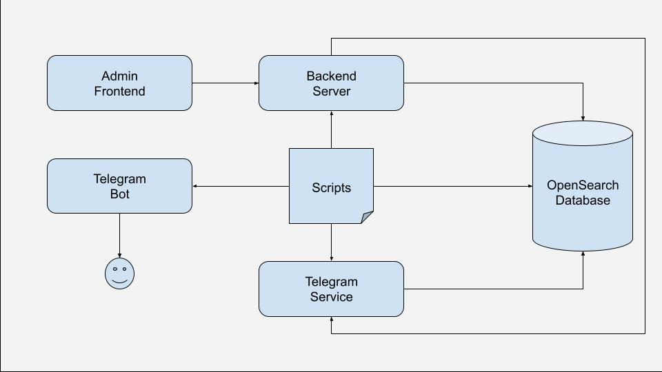

# SEN3 - Get keyword alerts from across all your favorite Telegram communities

## Project Description

Telegram hosts hundreds of vibrant communities sharing a constant stream of useful information—but keeping up can be overwhelming. This application collects messages from related channels and groups, and sends a user notifications only when their chosen keywords appear.

## Project motivation

I used to follow various telegram channels and groups that send news, shopping and food deals, but I wanted to only read the messages that interest me. The first version (called project SIFT) had fixed themes (news, shopping and food) and subscribers were unable to modify the channels/groups of each theme. After collecting some initial user feedback, I created this project that allows better management of channels/groups.

## Installation & set-up

1. You will need to obtain a valid telegram (and bot) api key from the official telegram website. This is required to create a Telegram bot to send a user notifications
2. Once you have your api key, create a `.env` at the root of this project. You may reference the keys from `.env.template`. Fill up the values on the `.env` file.
3. Run `docker compose start`. This should start up a container with 6 services.

## System Overview

The following diagram shows the high-level system of this project:

### OpenSearch Database

Primary database to store messages, channels, subscribers. Opensearch database provides built-in tools and configuration options that allows fine-tuning of how keyword matching and relevance scoring behave. Their keyword search also allow messages to be accurately matched and returned to users.

### Telegram Service

Communicates with official telegram APIs to retrieve messages, channel/group information

### Backend Server

UI backend server to serve the admin frontend application. Communicates with various services for different business needs

### Admin Frontend

UI for administrators to manage channels/groups and subscribers

### Scripts

Background jobs running every few minutes (customizable) to download messages from telegram, and sends notification to users upon keyword match

### Telegram Bot

Official telegram bot APIs to send messages, handle bot commands

## Contribution

This is a passion project of mine and it is closed for contribution. For bug reporting and suggestions, please send me a message directly!
