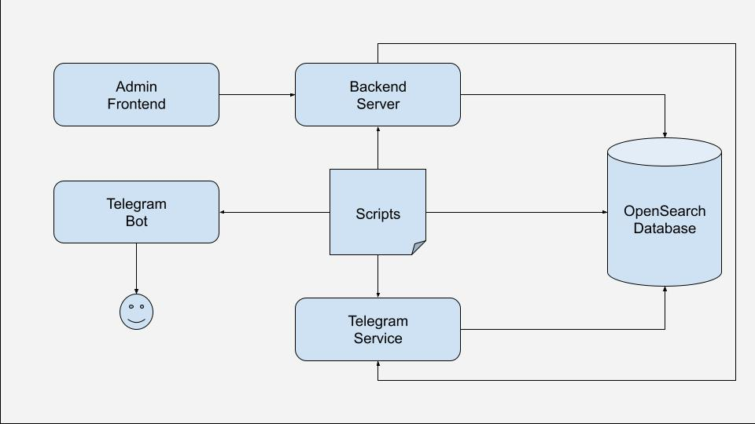

# SEN3 — Keyword Alerts for Telegram Communities

> Get keyword alerts from across all your favourite Telegram communities.

## Overview

Telegram hosts hundreds of vibrant communities sharing a constant stream of information — news, deals, announcements, and more. Keeping up manually is overwhelming. SEN3 solves this by continuously crawling subscribed chats and dispatching alerts to users the moment their keywords are matched, all managed through a clean admin dashboard.

## Motivation

I used to follow various Telegram channels and groups for news, shopping deals, and food recommendations — but I only ever wanted to read the messages that were actually relevant to me. SEN3 was created out of that frustration.

## System Architecture



## Features

- **Keyword alerting** — users define keyword sets ("decks") and receive Telegram notifications on matches
- **Multi-chat monitoring** — crawl any number of Telegram channels and groups concurrently
- **Deck management** — activate, mute, or modify decks at any time via Telegram bot commands
- **Default templates** — administrators can define deck templates that are automatically applied to new subscribers
- **Admin dashboard** — web UI for managing chats, subscribers, decks, and viewing analytics
- **Configurable intervals** — crawl frequency and notification dispatch cadence are environment-configurable

## Tech Stack

<!-- prettier-ignore -->
| Service | Technology | Port | Purpose |
|---|---|---|---|
| `opensearch-node` | OpenSearch 2.18 | 9200 | Primary database |
| `opensearch-dashboards` | OpenSearch Dashboards | 5601 | Database admin UI |
| `telegram-service` | Python 3.13 / Flask | 5099 | Telegram API bridge |
| `backend-service` | Node.js 22 / Express 5 / TypeScript | 5098 | REST API |
| `scripts` | Python 3.13 | — | Background jobs (crawl + notify) |
| `frontend` | React 19 / Nginx | 3400 | Admin dashboard |

## Prerequisites

- [Docker](https://docs.docker.com/get-docker/) and [Docker Compose](https://docs.docker.com/compose/install/)
- A Telegram account with an **API ID** and **API Hash** — obtain these from [my.telegram.org](https://my.telegram.org)
- A **Telegram Bot Token** — create a bot via [@BotFather](https://t.me/BotFather) on Telegram

## Installation & Setup

1. **Clone the repository**

   ```bash
   git clone https://github.com/your-username/sen3.git
   cd sen3
   ```

2. **Configure environment variables**

   Copy the template and fill in your values:

   ```bash
   cp .env.template .env
   ```

   Key variables to set:

<!-- prettier-ignore -->
   | Variable | Description |
   |---|---|
   | `OPENSEARCH_USERNAME` | OpenSearch admin username |
   | `OPENSEARCH_PASSWORD` | OpenSearch admin password |
   | `TELEGRAM_API_ID` | Telegram client API ID |
   | `TELEGRAM_API_HASH` | Telegram client API hash |
   | `TELEGRAM_BOT_TOKEN` | Telegram bot token from BotFather |
   | `TELEGRAM_BOT_ADMIN_TOKEN` | Secret token required for the `/approve_user` admin command |
   | `TELEGRAM_SERVICE_API_URL` | URL the backend uses to reach `telegram-service` |
   | `VITE_BACKEND_API_URL` | URL the frontend uses to reach the backend (leave empty when co-hosted) |

Refer to `.env.template` for the full list of variables and their descriptions.

3. **Start the stack**

   ```bash
   docker compose up
   ```

   All six services will start in dependency order. The `scripts` service waits for all other services to be healthy before running background jobs.

4. **Access the admin dashboard**

   Open [http://localhost:3400](http://localhost:3400) in your browser.

## Service Architecture

### OpenSearch Database

The primary data store for messages, chats, subscribers, decks, and notifications. OpenSearch's built-in full-text search and relevance scoring are used to match crawled messages against subscriber keyword sets accurately.

### Telegram Service

A lightweight Flask API that wraps the Telegram client API. The backend delegates all Telegram credential handling to this service, keeping secrets isolated and the REST API stateless.

### Backend Service

An Express 5 / TypeScript REST API that serves the admin frontend and coordinates business logic across OpenSearch and the Telegram Service. All endpoints are versioned under `/api/v1/`.

### Admin Frontend

A React 19 single-page application for administrators to manage chats, subscribers, decks, templates, and view notification analytics.

### Scripts

Three async background jobs run concurrently:

- **ChatMessagesBackgroundJob** — paginates new messages from active chats into OpenSearch
- **ChatUpdateBackgroundJob** — updates channel participant counts on a daily schedule
- **SubscriberNotificationBackgroundJob** — matches messages against subscriber decks and dispatches Telegram notifications

Job intervals are configurable via environment variables (`CHAT_MESSAGES_JOB_INTERVAL_MINS`, `SUBSCRIBER_NOTIFICATION_JOB_INTERVAL_MINS`, `CHAT_UPDATE_JOB_INTERVAL_DAYS`).

### Telegram Bot

Handles bot commands and delivers notification messages to subscribers. Supported user commands: `/start`, `/subscribe`, `/unsubscribe`, `/modifykeywords`, `/newdeck`, `/deletedeck`, `/mutedeck`, `/unmutedeck`. Admin command: `/approve_user`.

## Contributing

This is a passion project of mine and it is closed for contribution. For bug reports and feature suggestions, please open a [GitHub Issue](../../issues) — I'd love to hear from you!
